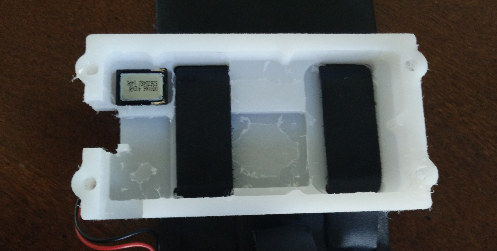
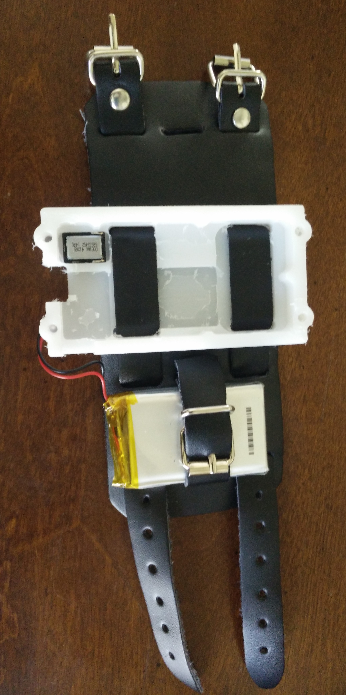
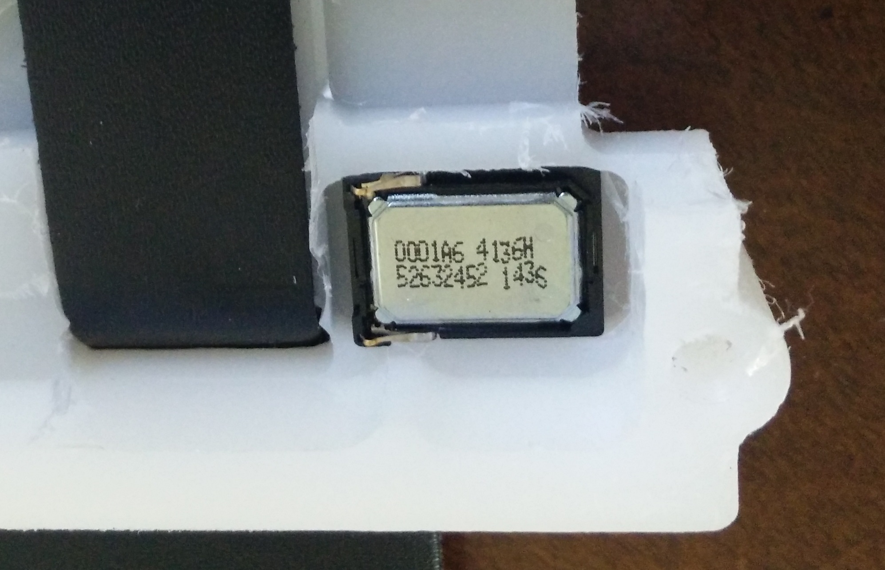
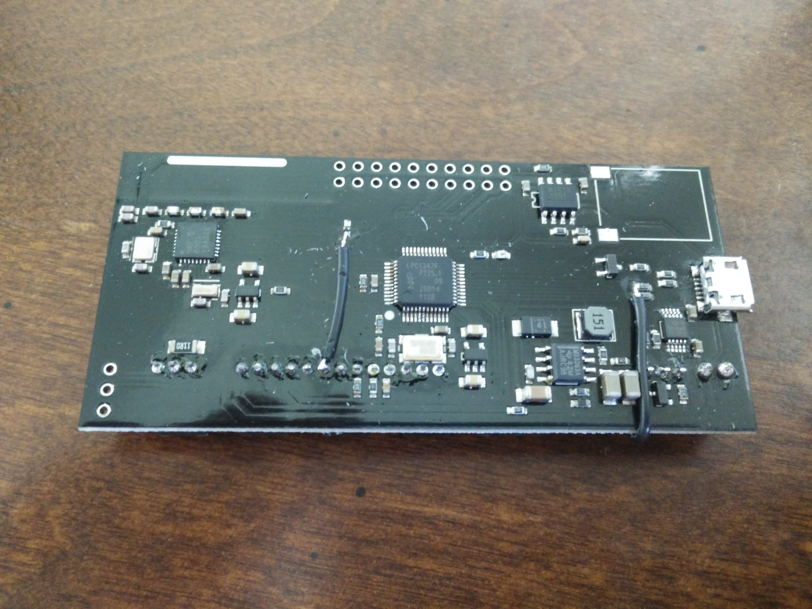
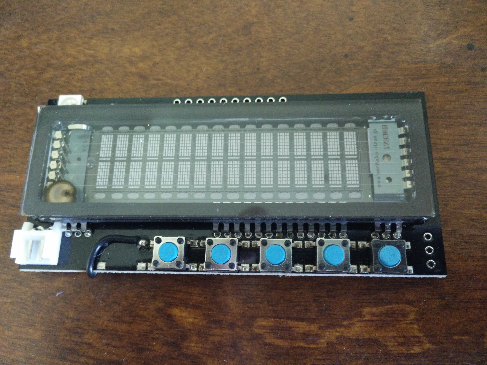
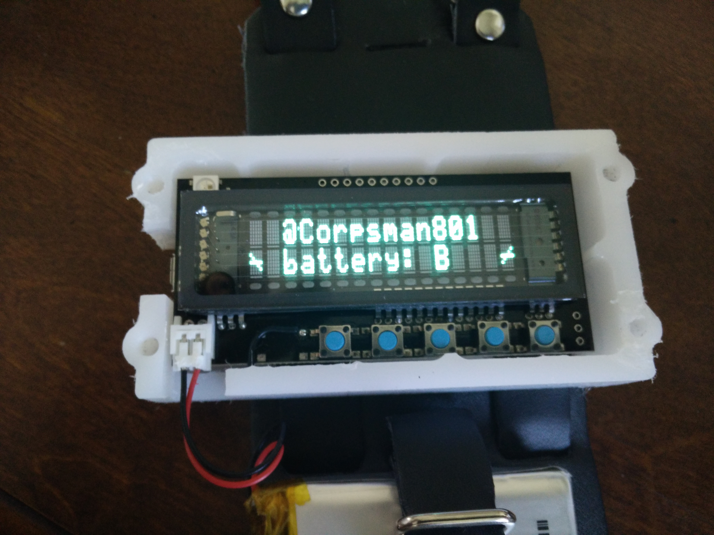
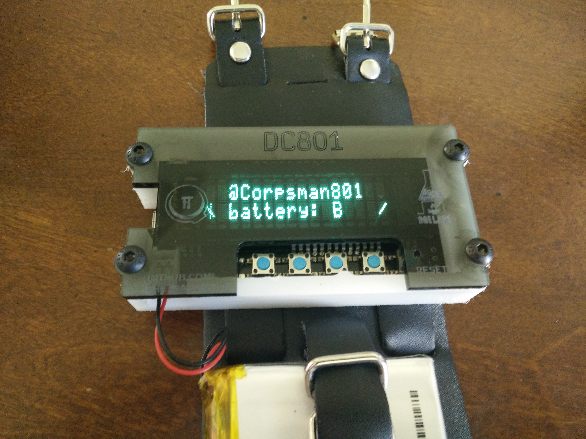

HPDE plastic case, custom cut for this project

HPDE case and leather band together

This is the mini speaker, connects via contact only, you can see the contacts in the next image. This image is flipped 180 degrees to show the speaker up right

Back of the board, note the contacts for the speak in the upper right corner

Front of the board. Most of this image is the VFD display on top of the main board. Not sure where the burn mark on the display came from.

The board mounted in the HPDE case

Cover screwed down and board powered up

